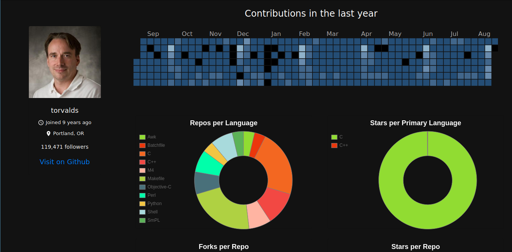

## git-see

#### Live on [https://gitsee-dev.netlify.app](https://gitsee-dev.netlify.app/)




git-see is the backend service to visualize Github user and basic
repo information of him/her. This can be used as a part of hiring 
talent into your organization for getting a gist about the candidate.
It is built using [Go](golang.org), [React](https://reactjs.org/) along with [Github V4 API](https://developer.github.com/v4/).

#### Setup your local backend instance
1. Clone this repo.
2. Add a ```.env``` file to the project root directly and add a Github token in the
following  format:
    ```GHTOKEN=<your-token>```
3. Install [Go](golang.org) if you already haven't.
3. Run ```go mod tidy``` or ```go mod download```
4. Now ```go run main.go```

#### Setup local front end instance
1. In another terminal window, clone [github.com/g14a/fe-gitsee](github.com/g14a/fe-gitsee) repo.
2. Install ```node``` if you already haven't.
3. Run ```npm install``` inside the root directory.
4. Once you've done that, run ```npm start``` in the root directory.
5. Head to [localhost:3000](localhost:3000) and check it out.

#### Run on Docker
1. Setup backend with
 
``` docker run -v /home/<USER>/.certs/:/etc/ssl/certs/ -it -p 8000:8000 --env-file .env```
2. Make sure you have the Github token as  ```GHTOKEN=<your-token>``` in an ```.env``` file.
3. You also need the minimum SSL certificates as we're interacting with Github's SSL. So we need to mount
the user's ```~/.certs``` to the containers root ```/etc/ssl/certs``` directory.
